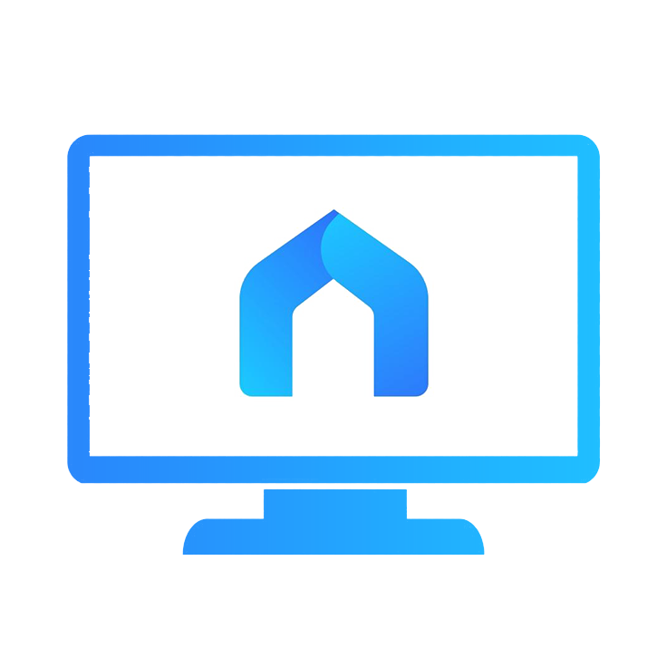

# Tapo Desktop Client

  

## About the Project
Tapo Desktop Client is a third-party desktop application designed to manage and view your Tapo smart cameras from your PC.

**Disclaimer:** This is **not** an official TP-Link application. This project was developed by reverse-engineering the Tapo Android application (specifically based on version 3.15.117 / Android 11) to understand and utilize the internal API protocols.

## Installation

* **Clone the repository:**
  Open your terminal and clone the project using the link below:
  `git clone https://github.com/praveenkurup/Tapo-Desktop-Client.git`

* **Install dependencies:**
  Navigate into the project folder and install the required Python packages:
  `pip install -r requirements.txt`

* **Run the application:**
  Start the client by running the main script:
  `python main.py`

## Configuration (Essential)
For the app to communicate with your cameras, you must provide your unique cloud credentials. This is **essential** for the application to function correctly.

You need to provide:
* **Authorization Token**
* **X-Term-Id**

### Setup Options
* **In-App:** You can open the application, navigate to the **Settings** page, and enter the values directly into the UI.
* **Environment File:** Alternatively, you can create a `.env` file in the root directory and define the variables there:
  `Authorization=YOUR_TOKEN_HERE`
  `X-Term-Id=YOUR_ID_HERE`

> **Note:** These values are obtained by **sniffing a single network packet** from the official Tapo Android app while it is active on your phone. You can use tools like PCAPDroid or Charles Proxy to capture this data.

## Video Streaming
The application utilizes the built-in **RTSP** (Real Time Streaming Protocol) provided by Tapo cameras for the live feed.

* **Activation:** You must enable the RTSP stream or Camera Account feature within the official Tapo app settings first.
* **Local Network:** By default, the video stream will only work if your computer is on the same **private network** as the cameras.
* **Remote Access:** To view the stream over the internet, you can use a **Proxy**, **Port Forwarding**, or a **VPN** to securely bridge the connection to your home network.

## Contributions
I am open to contributions! If you have ideas for new features, bug fixes, or performance improvements, feel free to open an issue or submit a pull request.